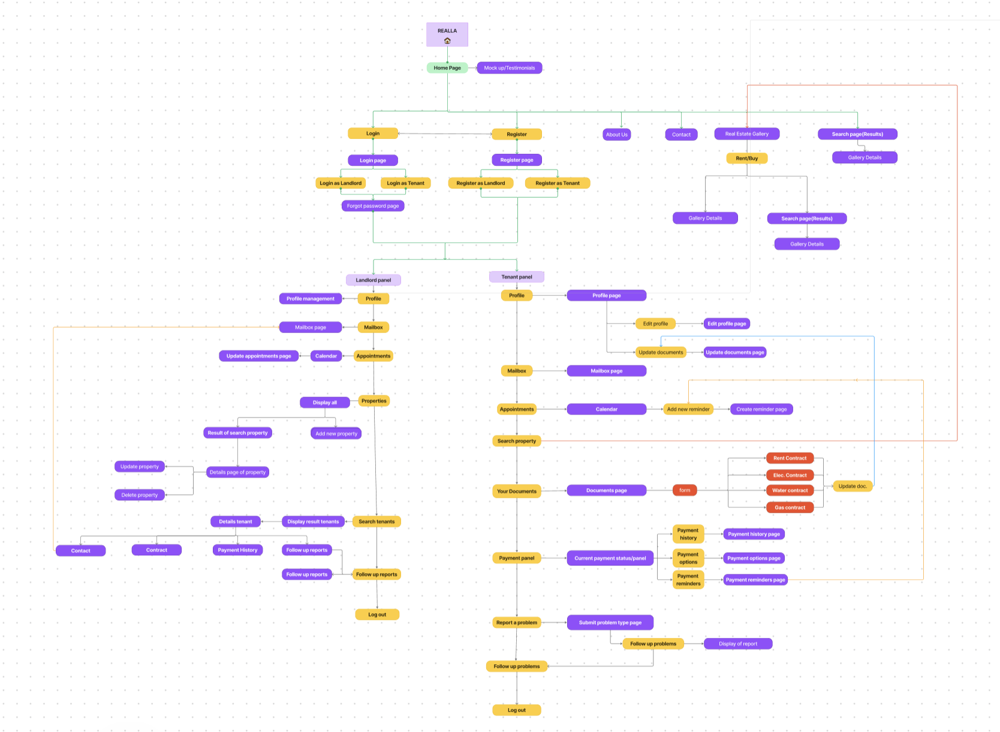

# Realla Home Tool

Team members and their roles: 

Sezin: Frontend and backend
Funda: Frontend
Mohammed: Frontend and backend
Jana: Frontend

Explains briefly about the technology usage & choices: 

The technologies we used for our project are React, Vite, Laravel, Inertia, MySQL and Tailwind CSS

Our Sitemap:

Introduces the project in a fun, easy to read/scan way 
🎉 Welcome to REALLA! Your one-stop solution for all your renting needs! 🎉

🏠 Looking for the perfect place to call home? Search through our extensive database of listings to find your dream rental! 

📅 Schedule appointments with ease to view properties or meet with your landlord. 

🔧 Report any issues or concerns you encounter, and track their resolution every step of the way. 

💰 Keep track of your monthly payments and access all necessary documents hassle-free. 

💬 Communicate in real-time through our chat/mailbox feature with your landlord, tenant, or any other service providers you may need like gardeners or cleaners. 

🌟 Experience seamless renting with REALLA – where every issue finds a solution! 🌟
